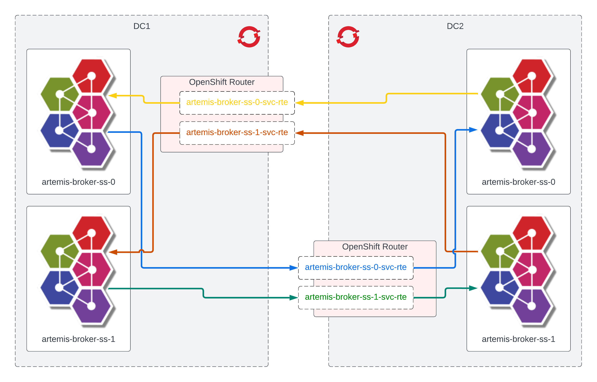

# Artemis Federation Demo

This demo shows how to configure and set up a [Federation](https://activemq.apache.org/components/artemis/documentation/latest/federation) between two DCs on OpenShift using the Artemis Operator. There are two different demos that both achieve the same end-result, but in different ways. The first one uses manual TLS configuration, and the second uses [Skupper](https://skupper.io/).

## [Manual TLS](./manual-tls/README.md)

## [Skupper](./skupper/README.md)

