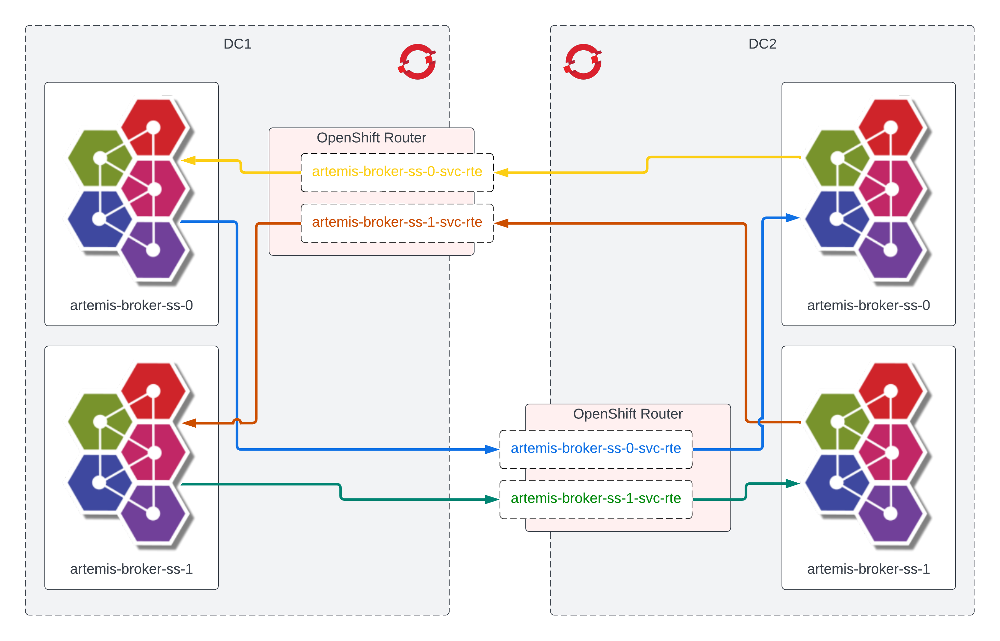

# Artemis Federation Demo - Manual TLS



## TLS

Create the DC1 and DC2 keystores.

```
env \
BROKER_NAME=artemis-broker \
BROKER_COUNT=2 \
DOMAIN=apps.cluster-zz9jt.zz9jt.sandbox2715.opentlc.com \
NAMESPACE=dc1 \
KEYSTORE=./tls/dc1-broker-keystore.jks \
KEYSTORE_PASS=password \
./bin/generate-keystore.sh

env \
BROKER_NAME=artemis-broker \
BROKER_COUNT=2 \
DOMAIN=apps.cluster-zz9jt.zz9jt.sandbox2715.opentlc.com \
NAMESPACE=dc2 \
KEYSTORE=./tls/dc2-broker-keystore.jks \
KEYSTORE_PASS=password \
./bin/generate-keystore.sh
```

Generate the DC1 and DC2 truststores.

```
env \
KEYSTORE_DC=dc2 \
KEYSTORE=./tls/dc2-broker-keystore.jks \
KEYSTORE_PASS=password \
TRUSTSTORE=./tls/dc1-broker-truststore.jks \
TRUSTSTORE_PASS=password \
./bin/generate-truststore.sh

env \
KEYSTORE_DC=dc1 \
KEYSTORE=./tls/dc1-broker-keystore.jks \
KEYSTORE_PASS=password \
TRUSTSTORE=./tls/dc2-broker-truststore.jks \
TRUSTSTORE_PASS=password \
./bin/generate-truststore.sh
```

(Optional) Generate the client truststore.

```
env \
KEYSTORE_DC=dc1 \
KEYSTORE=./tls/dc1-broker-keystore.jks \
KEYSTORE_PASS=password \
TRUSTSTORE=./tls/client-truststore.jks \
TRUSTSTORE_PASS=password \
./bin/generate-truststore.sh

env \
KEYSTORE_DC=dc2 \
KEYSTORE=./tls/dc2-broker-keystore.jks \
KEYSTORE_PASS=password \
TRUSTSTORE=./tls/client-truststore.jks \
TRUSTSTORE_PASS=password \
./bin/generate-truststore.sh
```

## Artemis

Install the AMQ Broker Operator using OperatorHub (must be done as a cluster-admin). You can do this per-namespace, or globally across all namespaces.

Create and configure the DC1 AMQ Broker cluster. __Note: You must modify the `artemis-broker.yaml` file with your environment specific information before you apply it. You can either do this manually by simply editing the file, or you can use the `envsubst` command as shown below.__

```
#
# Create the OpenShift project.
oc new-project dc1

#
# Create the secret containing the broker's keystore and truststore.
oc create secret generic -n dc1 artemis-broker-tls-secret --from-file=broker.ks=./tls/dc1-broker-keystore.jks --from-file=client.ts=./tls/dc1-broker-truststore.jks --from-literal=keyStorePassword=password --from-literal=trustStorePassword=password

#
# Apply the authorization policies for the broker and console.
oc apply -n dc1 -f ./dc1/artemis-security.yaml

#
# Modify the broker cluster CR with your environment specific details and apply. Make sure to use the `${STATEFUL_SET_ORDINAL}` placeholder in your host string so that the federation applies properly (ie, ordinal-0 -> ordinal-0, ordinal-1 -> ordinal-1, ... etc). You can retrieve the generated admin password for the DC2 cluster via the web console, or via the following command `oc get secret -n dc2 security-properties-broker-prop-module -o=jsonpath='{.data.admin}' | base64 -d`. However, you must have applied the `artemis-security.yaml` in DC2 for this secret to have been generated. So you might have to hop back and forth between DC's just a bit.
env \
DC2_HOST='artemis-broker-core-tls-${STATEFUL_SET_ORDINAL}-svc-rte-dc2.apps.cluster-zz9jt.zz9jt.sandbox2715.opentlc.com' \
DC2_PORT=443 \
DC2_USER=admin \
DC2_PASS='4CrF5Ulk' \
bash -c 'cat ./dc1/artemis-broker.yaml | envsubst | oc apply -n dc1 -f-'

#
# Apply the addresses to be created on the brokers.
oc apply -n dc1 -f ./dc1/artemis-addresses.yaml
```

Create and configure the DC2 AMQ Broker cluster. __Note: You must modify the `artemis-broker.yaml` file with your environment specific information before you apply it. You can either do this manually by simply editing the file, or you can use the `envsubst` command as shown below.__

```
#
# Create the OpenShift project.
oc new-project dc2

#
# Create the secret containing the broker's keystore and truststore.
oc create secret generic -n dc2 artemis-broker-tls-secret --from-file=broker.ks=./tls/dc2-broker-keystore.jks --from-file=client.ts=./tls/dc2-broker-truststore.jks --from-literal=keyStorePassword=password --from-literal=trustStorePassword=password

#
# Apply the authorization policies for the broker and console.
oc apply -n dc2 -f ./dc2/artemis-security.yaml

#
# Modify the broker cluster CR with your environment specific details and apply. Make sure to use the `${STATEFUL_SET_ORDINAL}` placeholder in your host string so that the federation applies properly (ie, ordinal-0 -> ordinal-0, ordinal-1 -> ordinal-1, ... etc). You can retrieve the generated admin password for the DC1 cluster via the web console, or via the following command `oc get secret -n dc1 security-properties-broker-prop-module -o=jsonpath='{.data.admin}' | base64 -d`. However, you must have applied the `artemis-security.yaml` in DC1 for this secret to have been generated. So you might have to hop back and forth between DC's just a bit.
env \
DC1_HOST='artemis-broker-core-tls-${STATEFUL_SET_ORDINAL}-svc-rte-dc1.apps.cluster-zz9jt.zz9jt.sandbox2715.opentlc.com' \
DC1_PORT=443 \
DC1_USER=admin \
DC1_PASS='lIZmbMVg' \
bash -c 'cat ./dc2/artemis-broker.yaml | envsubst | oc apply -n dc2 -f-'

#
# Apply the addresses to be created on the brokers.
oc apply -n dc2 -f ./dc2/artemis-addresses.yaml
```

## Testing

You can use whatever client you'd like for testing. For my testing, I used the AMQP client located https://github.com/joshdreagan/amqp-clients.

Launch a producer connected to DC1 and a consumer connected to DC2. You can retrieve the generated 'user' password for each cluster via the web console, or via the following command `oc get secret -n dc1 security-properties-broker-prop-module -o=jsonpath='{.data.user}' | base64 -d`. Make sure to fetch the passwords for both DCs.

__Terminal 1__


Launch a producer connected to the broker on DC1. Make sure to replace the host with the exposed OpenShift route for DC1.

```
mvn spring-boot:run '-Damqp.destination.name=app.foo' "-Damqphub.amqp10jms.remote-url=amqps://artemis-broker-amqp-tls-0-svc-rte-dc1.apps.cluster-zz9jt.zz9jt.sandbox2715.opentlc.com:443?jms.username=user&jms.password=m3Zwr2Iq&transport.trustStoreLocation=${ABS_PROJECT_ROOT}/manual-tls/tls/client-truststore.jks&transport.trustStorePassword=password"
```

__Terminal 1__


Launch a producer connected to the broker on DC1. Make sure to replace the host with the exposed OpenShift route for DC1.

```
mvn spring-boot:run '-Damqp.destination.name=app.foo' '-Damqphub.amqp10jms.remote-url=amqps://artemis-broker-amqp-tls-0-svc-rte-dc2.apps.cluster-zz9jt.zz9jt.sandbox2715.opentlc.com:443?jms.username=user&jms.password=6fDXhUxt&transport.trustStoreLocation=${ABS_PROJECT_ROOT}/manual-tls/tls/client-truststore.jks&transport.trustStorePassword=password' 
```

You should see messages flow across the network.
