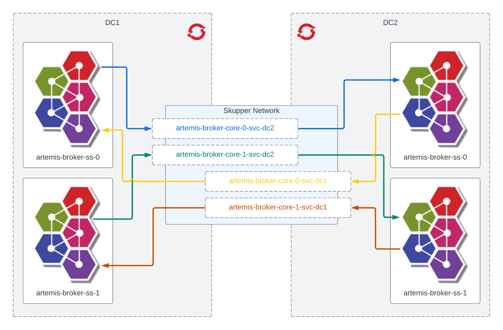

# Artemis Federation Demo - Skupper



## Skupper

Skupper sites can be created and linked either via the skupper-cli, or via the OpenShift operator. In this example, I'm going to use the operator. All of the steps can be completed (ie, creating sites, linking sites, and exposing services) with the equivalent `skupper` commands.

Install the Red Hat Service Interconnect Operator using OperatorHub (must be done as a cluster-admin). You can do this per-namespace, or globally across all namespaces.

Create the DC1 Skupper site, then generate and fetch the site token.

```
#
# Create the OpenShift project.
oc new-project dc1

#
# Create the Skupper site.
oc -n dc1 apply -f ./dc1/skupper-site.yaml

#
# Issue a site token request.
oc -n dc1 apply -f ./dc1/token-request.yaml

#
# Fetch the generated site token.
oc -n dc1 get secret -o yaml dc1-site-token | yq 'del(.metadata.namespace)' > ./dc1/token.yaml
```

Create the DC2 Skupper site, then generate and fetch the site token.

```
#
# Create the OpenShift project.
oc new-project dc2

#
# Create the Skupper site.
oc -n dc2 apply -f ./dc2/skupper-site.yaml

#
# Issue a site token request.
oc -n dc2 apply -f ./dc2/token-request.yaml

#
# Fetch the generated site token.
oc -n dc2 get secret -o yaml dc2-site-token | yq 'del(.metadata.namespace)' > ./dc2/token.yaml
```

Link the Skupper sites.

```
oc -n dc1 apply -f ./dc2/token.yaml
oc -n dc2 apply -f ./dc1/token.yaml
```

## Artemis

Install the AMQ Broker Operator using OperatorHub (must be done as a cluster-admin). You can do this per-namespace, or globally across all namespaces.

Create and configure the DC1 AMQ Broker cluster. __Note: You must modify the `artemis-broker.yaml` file with your environment specific information before you apply it. You can either do this manually by simply editing the file, or you can use the `envsubst` command as shown below.__

```
#
# Apply the authorization policies for the broker and console.
oc apply -n dc1 -f ./dc1/artemis-security.yaml

#
# Modify the broker cluster CR with your environment specific details and apply. Make sure to use the `${STATEFUL_SET_ORDINAL}` placeholder in your host string so that the federation applies properly (ie, ordinal-0 -> ordinal-0, ordinal-1 -> ordinal-1, ... etc). You can retrieve the generated admin password for the DC2 cluster via the web console, or via the following command `oc get secret -n dc2 security-properties-broker-prop-module -o=jsonpath='{.data.admin}' | base64 -d`. However, you must have applied the `artemis-security.yaml` in DC2 for this secret to have been generated. So you might have to hop back and forth between DC's just a bit.
env \
DC2_HOST='artemis-broker-core-${STATEFUL_SET_ORDINAL}-svc-dc2' \
DC2_PORT=61616 \
DC2_USER=admin \
DC2_PASS='4CrF5Ulk' \
bash -c 'cat ./dc1/artemis-broker.yaml | envsubst | oc apply -n dc1 -f-'

#
# Apply the addresses to be created on the brokers.
oc apply -n dc1 -f ./dc1/artemis-addresses.yaml

#
# Expose the services to the Skupper network.
for i in {0..1};
do
  oc -n dc1 annotate service artemis-broker-core-$i-svc "skupper.io/address=artemis-broker-core-$i-svc-dc1" "skupper.io/port=61616" "skupper.io/proxy=tcp"
  oc -n dc1 annotate service artemis-broker-amqp-$i-svc "skupper.io/address=artemis-broker-amqp-$i-svc-dc1" "skupper.io/port=5672" "skupper.io/proxy=tcp"
done;
```

Create and configure the DC2 AMQ Broker cluster. __Note: You must modify the `artemis-broker.yaml` file with your environment specific information before you apply it. You can either do this manually by simply editing the file, or you can use the `envsubst` command as shown below.__

```
#
# Apply the authorization policies for the broker and console.
oc apply -n dc2 -f ./dc2/artemis-security.yaml

#
# Modify the broker cluster CR with your environment specific details and apply. Make sure to use the `${STATEFUL_SET_ORDINAL}` placeholder in your host string so that the federation applies properly (ie, ordinal-0 -> ordinal-0, ordinal-1 -> ordinal-1, ... etc). You can retrieve the generated admin password for the DC1 cluster via the web console, or via the following command `oc get secret -n dc1 security-properties-broker-prop-module -o=jsonpath='{.data.admin}' | base64 -d`. However, you must have applied the `artemis-security.yaml` in DC1 for this secret to have been generated. So you might have to hop back and forth between DC's just a bit.
env \
DC1_HOST='artemis-broker-core-${STATEFUL_SET_ORDINAL}-svc-dc1' \
DC1_PORT=61616 \
DC1_USER=admin \
DC1_PASS='lIZmbMVg' \
bash -c 'cat ./dc2/artemis-broker.yaml | envsubst | oc apply -n dc2 -f-'

#
# Apply the addresses to be created on the brokers.
oc apply -n dc2 -f ./dc2/artemis-addresses.yaml

#
# Expose the services to the Skupper network.
for i in {0..1};
do
  oc -n dc1 annotate service artemis-broker-core-$i-svc "skupper.io/address=artemis-broker-core-$i-svc-dc2" "skupper.io/port=61616" "skupper.io/proxy=tcp"
  oc -n dc1 annotate service artemis-broker-amqp-$i-svc "skupper.io/address=artemis-broker-amqp-$i-svc-dc2" "skupper.io/port=5672" "skupper.io/proxy=tcp"
done;
```

## Testing

You can use whatever client you'd like for testing. For my testing, I used the AMQP client located https://github.com/joshdreagan/amqp-clients.

Install the OpenShift and Skupper command-line tools.

Login to the OpenShift cluster. It doesn't matter which cluster you login to as they are linked.

```
#
# Initialize a gateway and connect it to the Skupper network.
skupper gateway init --type service

#
# Expose the AMQP services from the Skupper network to the local machine.
skupper gateway forward artemis-broker-amqp-0-svc-dc1 5672
skupper gateway forward artemis-broker-amqp-0-svc-dc2 5672

#
# Get the port mappings for the exposed services. Make sure to note the port for the DC1 service, and the port for the DC2 service.
skupper gateway status
```

Launch a producer connected to DC1 and a consumer connected to DC2. You can retrieve the generated 'user' password for each cluster via the web console, or via the following command `oc get secret -n dc1 security-properties-broker-prop-module -o=jsonpath='{.data.user}' | base64 -d`. Make sure to fetch the passwords for both DCs.

__Terminal 1__

Launch a producer connected to the broker on DC1. Make sure to replace the port with the exposed port for DC1 that you found in the previous step.

```
mvn spring-boot:run '-Damqp.destination.name=app.foo' '-Damqphub.amqp10jms.remote-url=amqp://localhost:5672?jms.username=user&jms.password=m3Zwr2Iq'
```

__Terminal 1__

Launch a consumer connected to the broker on DC2. Make sure to replace the port with the exposed port for DC2 that you found in the previous step.

```
mvn spring-boot:run '-Damqp.destination.name=app.foo' '-Damqphub.amqp10jms.remote-url=amqp://localhost:46459?jms.username=user&jms.password=6fDXhUxt'
```

You should see messages flow across the network.
